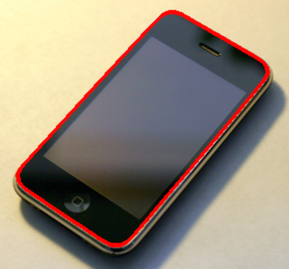
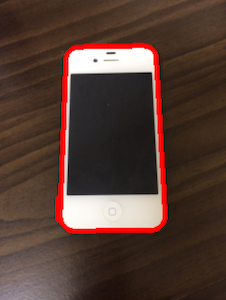
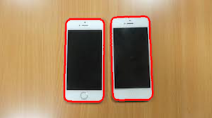

# Contour based iPhone detector

## DetectIPhone class

### constructor(im)

#### params
| name | description |
| :-: | :- |
| im | OpenCV image object |

### detect5S()

detect iPhone 5S from specfied image file

### detect4S()

detect iPhone 4S from specfied image file


## useage

```python
import cv2
from detect_iphone import *


def imresize(im, width=0, height=0):
    u""" resize image
    """
    if width > 0 and height > 0:
        dim = (width, height)
    elif width > 0:
        r = width*1.0 / im.shape[1]
        dim = (width, int(im.shape[0] * r))
    elif height > 0:
        r = height*1.0 / im.shape[0]
        dim = (int(im.shape[1] * r), height)
    else:
        return im

    return cv2.resize(im, dim, interpolation = cv2.INTER_AREA)


def out_cnts(im, cnts, winname='result', color=(0, 0, 255)):
    cv2.drawContours(im, [cnts], -1, color, 3)
    cv2.imshow(winname, im)
    cv2.waitKey(0)


# read and resize image
im = cv2.imread('path/to/image_file)

# Making image smaller to reduce processing time.
im = imresize(im, height=300)

detector = DetectIPhone(im)
detects = detector.detect5S()
if len(detects) > 0:
    for cnt in detects:
            out_cnts(im, cnt)
else:
    print('iPhone is not detected')
```

## Result Sample






